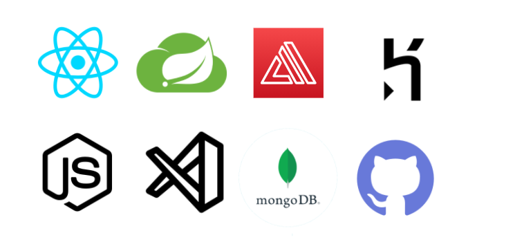

# GenesisEsports 

  

<h1>Overview </h1>
<h3>Description</h3>
Competitive Esports is a form of sports competition that includes videogames. It involves professional players from all around the globe that compete against one another for trophies and prize pools. This creates a problem with non-professional players who love the competition but are not skillful enough to play at a professional level. This problem has gotten a lot of attention recently due to Esports growing rapidly and the amount of casual players growing with it as well, all of these casual players don’t have a setting to play in and the Esports Tournament Website is an example of a solution to this growing problem. 

The Esports Tournament Website, is an online web application that will help users online connect with friends, make teams, and compete in a high-level setting. The user will be able to create their own profile and either make a team or join one.  On the admin side of the webpage, admins will be able to create leagues for these players so the teams can join and compete to win prizes and gain popularity among the ranks.
<h3>Technologies Used</h3>

  

<h3>Click below for more information about technologies used!</h3>

  
Click to Expand

  <b>React JS</b>
  <blockquote>
    React will let developers make large scale web applications that can render data, without the need to manually reload the   page. This is an event driven architecture which is different from MVC and will let the data display dependent on the event that is fired on the page. React is simple, fast and scalable and allows the use of reusable UI components.
  </blockquote>
  <b>Spring Boot</b>
  <blockquote>
    Spring is one of the most popular Java-Based frameworks to build enterprise applications, different from other frameworks that focus on only a single area of development Spring Framework will allow a user a veriety of features such as: REST, XML/Annotation/Java based configuration, bean injetion and many more. I used Spring Boot to build my REST service which was simple and clear to use. 
  </blockquote>
  <b>AWS Amplify</b>
  <blockquote>
    AWS Amplify is designed to be a package of tools and services that will make it easy for a developer to deply their application. It includes code libraries, ready-to-use components and a built in CLI. The friendly UI and self explanitory CLI makes it a friendly tool for developers to use this AWS Service. Some of the features that I liked about this cloud were the Data Storage, Analytics, Notifications, Authentication and last but not least the cost is fair and amazing for developers to deploy their personal projects.
  </blockquote>
  <b>Heroku</b>
  <blockquote>
    Heroku is a Platform as a Service (PaaS), a cloud that handles the deployment, managment and scalibility of most moderin apps. The platform is easy to use and offers the simplest deployment UI, but it also has its own CLI as well. It is fully managed on its own givint the developers the freedome to work on their own application.
  </blockquote>
  <b>Node.JS</b>
  <blockquote>
    Node.JS was a technology that I used primarily for the node package manager, which was used in my react application. This         event driven architecture fit in perfectly with the application that I developed and was able to assist for a simple and good     design.
  </blockquote>
  <b>Visual Studio Code</b>
  <blockquote>
    Visual Studio Code is a easy to use and intuitive code editor that is wildly popular among developers. In my application I       used it in order to develop my React application. It provided alot of extensions that were helpful throughout development.
  </blockquote>
  <b>MongoDB</b>
  <blockquote>
    Unlike other database technologies, MongoDb is a document based database that is built on the scale-out architecture. It provides horizontal scalibility which will allow high volume of data and trafic. My application with the event driven architecture has alot of calls that are made to the database, and this NoSQL database was proven to be efficient and most useful.
  </blockquote>
  <b>GitHub</b>
  <blockquote>
    GitHub is an open source code reopsitory that uses the git technology for revision controls and runs in command line interface. It is the most popular source control software in the world and that is due to the simplicity and professinal look that the website has. It is simple to use both as a developer and as a user who is just viewing code. I used GitHub in order to simply store my code online and connect my clouds to my repository in order to deploy.
  </blockquote>
 

 <h1>High-level Functional and Non-functional Requirements</h1>
  <h3>High-Level Requirements</h3>
  The GenesisEsports application supports alot of high-level functional requirments throughout the application. The Website is build with a Spring Boot application as a REST Service with full CRUD functionality for User, Teams, Leagues and Matches. Once a User is logged in they have the ability to Login or Register, once in the application the user then will have the choice to join a team or create a team and depending where they are in the application they will be prompted that some settings are limited so they will be asked to join a team. On the admin side the admin can create a league and will allow the team leaders to join a league. Once a league has teams in it the admin will be able to lock it, enabeling the application to create matches based on how many teams there are in the league.
  <h3>Non-functional Requirements</h3>
  The GenesisEsports application has simple Non-Functional reqirements such as page responsiness and availibility. The client side react application has pages built with MaterialUI therefore making the pages responsive. The application is deployed on Heroku and AWS Amplify, making it availible to the client at all times and easily recoverable.
